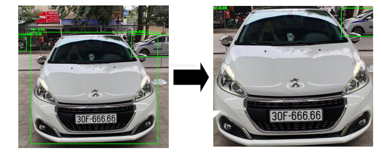
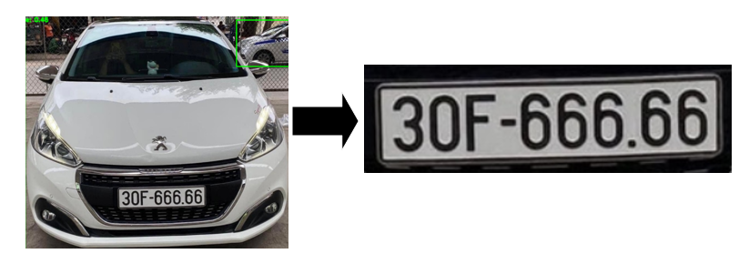
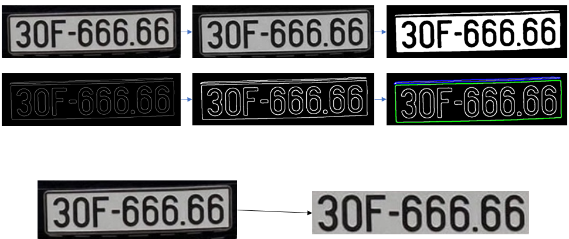
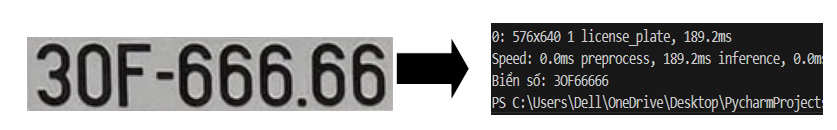
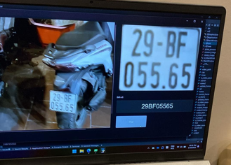

```md
## OVERVIEW OF THE PROCESSING PIPELINE

*(Detailed System Workflow)*

The proposed system follows a multi-stage perception–decision–control pipeline, integrating
computer vision, embedded systems, and hardware actuation for automated vehicle access control.

---

## 1. Image Processing Pipeline

### Step 1: Vehicle Detection

* **YOLO-based Detection**  
  The input image is passed through a YOLO-based object detection model to detect vehicles such as cars and motorcycles.
  Each detected object is represented by a bounding box.

  

* **Primary Vehicle Selection**  
  For each bounding box, the area is calculated as:

  \[
  (x_2 - x_1) \times (y_2 - y_1)
  \]

  The bounding box with the **largest area** is selected as the primary vehicle, assuming it corresponds to the vehicle
  closest to the camera and most relevant for further processing.

---

### Step 2: License Plate Localization

To accurately extract the license plate region, a classical computer vision pipeline is applied
to the selected vehicle region.

*Example of license plate localization on the detected vehicle:*



a) **Image Resizing**  
The image is resized to a fixed area of approximately **250,000 pixels** to ensure consistent processing speed
and scale invariance.

b) **Grayscale Conversion**  
The resized image is converted from RGB (or BGR) to grayscale to reduce color complexity and focus on structural
information.

c) **Gaussian Blurring**  
A Gaussian blur filter is applied to suppress noise and remove small irrelevant details.

d) **Binary Thresholding (Otsu Method)**  
Otsu’s thresholding method is used to automatically determine the optimal threshold value, producing a binary image
that highlights candidate license plate regions.

e) **Edge Detection (Canny)**  
The Canny edge detector is applied to identify strong edges corresponding to license plate boundaries.

f) **Morphological Dilation**  
Dilation is performed to connect broken edges and enhance rectangular structures.

g) **Contour Detection**  
Contours are extracted from the processed image. Candidate contours are filtered based on geometric constraints
such as aspect ratio and area.

h) **Perspective Transformation**  
A perspective (homography) transformation is applied to flatten the license plate region, improving OCR accuracy.

**License Plate Cropping and Rectification Example:**

After perspective warping:



---

## 2. Information Processing and Control Pipeline

### Step 1: Arduino Initialization

* **Hardware Interface Setup**
  * Configure RFID module for ID authentication
  * Initialize camera for vehicle image capture
  * Configure relay and servo motor for barrier control

* **Software Integration**
  * Qt Creator is used as the graphical user interface
  * Integrated libraries:
    * **OpenCV** – image preprocessing and geometric transformations
    * **YOLO** – vehicle and license plate detection
    * **OCR Engine** – character recognition from license plates

---

### Step 2: Camera Activation

* **RFID Trigger**
  * When an RFID card is scanned, the system checks its validity against the local database.
  * If valid, a signal is sent to activate the camera.

* **Image Capture**
  * The camera captures the vehicle image.
  * The image is temporarily stored and forwarded to the image processing module.

---

### Step 3: Image Processing

#### 3.1 License Plate Detection

* **Input:** Captured vehicle image  
* **Process:** YOLO-based detection of the license plate region  
* **Output:** Cropped license plate image

#### 3.2 License Plate Image Enhancement

* Grayscale conversion
* Gaussian smoothing to reduce noise
* Canny edge detection
* Perspective correction for tilted or distorted plates

#### 3.3 Optical Character Recognition (OCR)

* The OCR engine extracts alphanumeric characters from the rectified license plate image
* Output example:

```

30F-666.66

````

**OCR Result Example:**



---

### Step 4: License Plate and RFID Matching

* **Purpose**  
  To verify whether the recognized license plate corresponds to the scanned RFID ID.

* **Database Storage**
  * Valid RFID–license plate pairs are stored in `data.txt`
  * Format:
    ```
    RFID_ID → License_Plate
    ```

* **Verification**
  * OCR output is sent to the Qt interface
  * The system checks for a match between the RFID ID and the recognized license plate

---

### Step 5: Barrier Control via Arduino

* **Authorized Vehicle**
  1. Qt sends a confirmation signal to Arduino
  2. Arduino activates the servo motor to open the barrier

* **Unauthorized Vehicle**
  1. Barrier remains closed
  2. System waits for the next RFID scan

---

### Step 6: Continuous Operation Loop

After processing one vehicle:

1. Barrier closes (servo returns to default position)
2. Camera and Arduino return to idle state

The system continuously repeats the processing cycle.

**System GUI during operation:**



---
````

---

